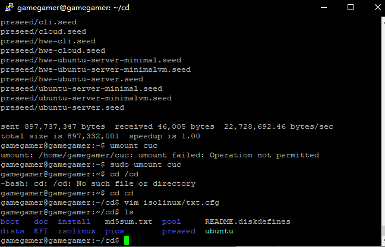
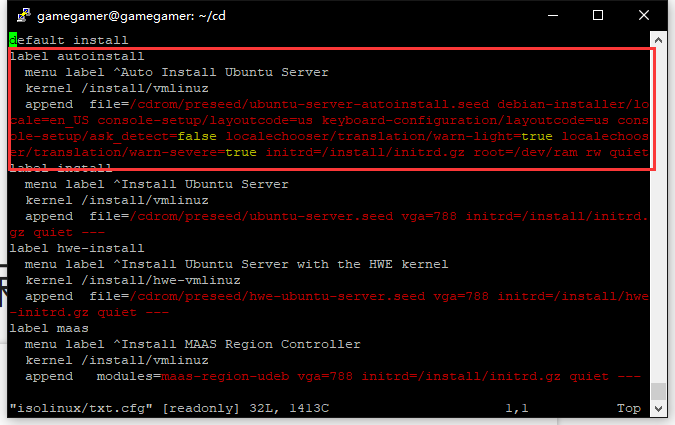
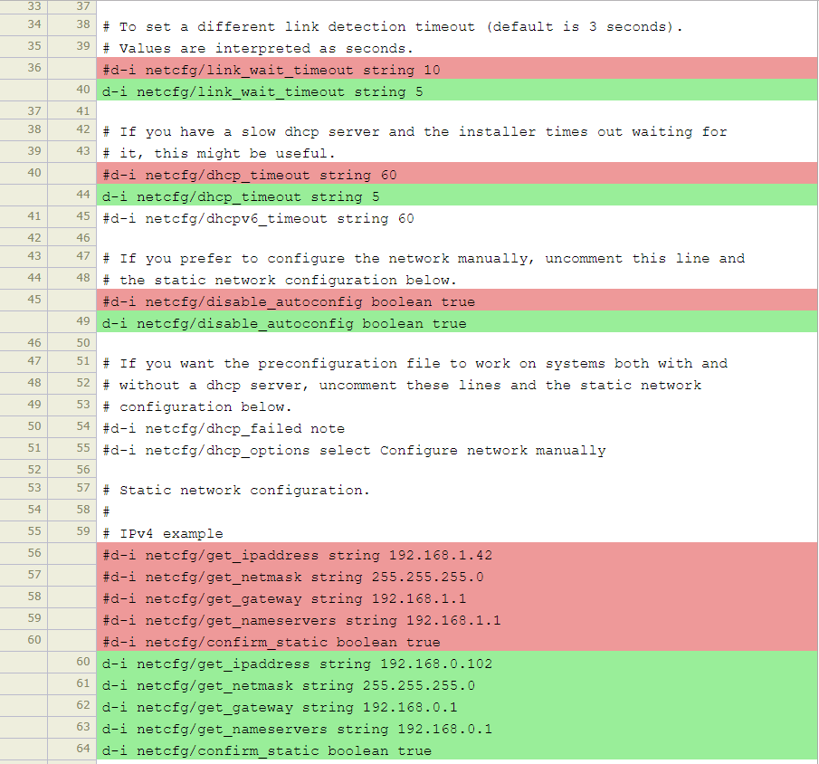
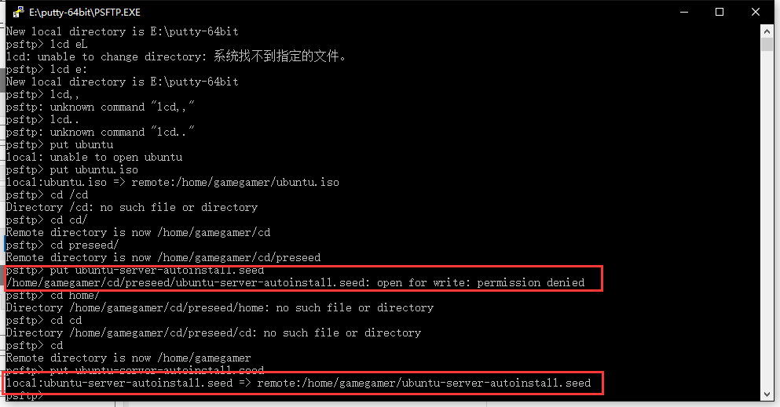
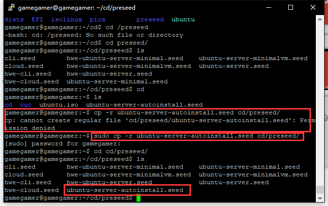
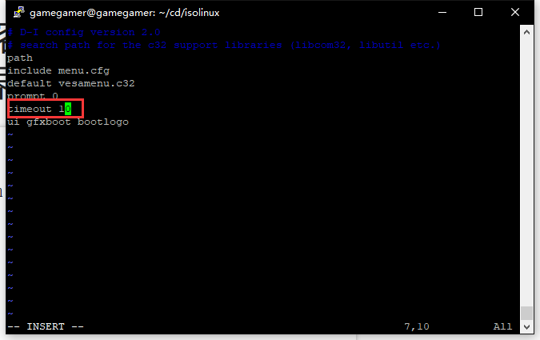
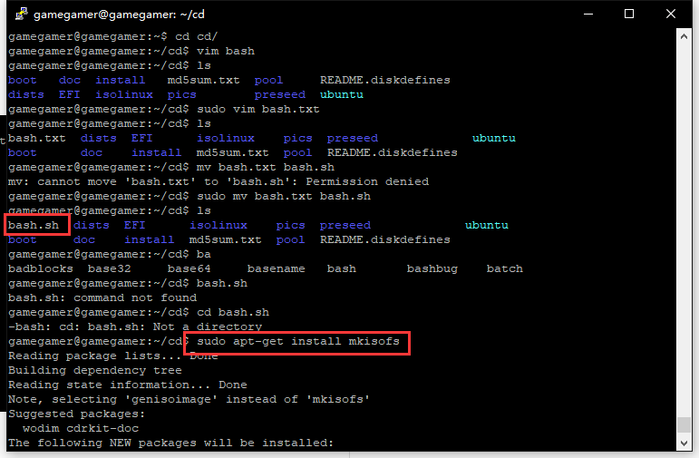
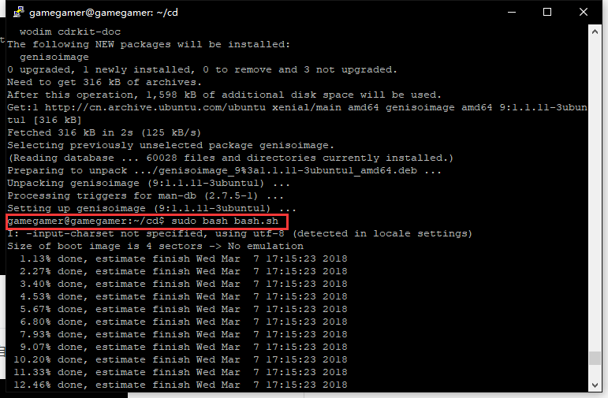
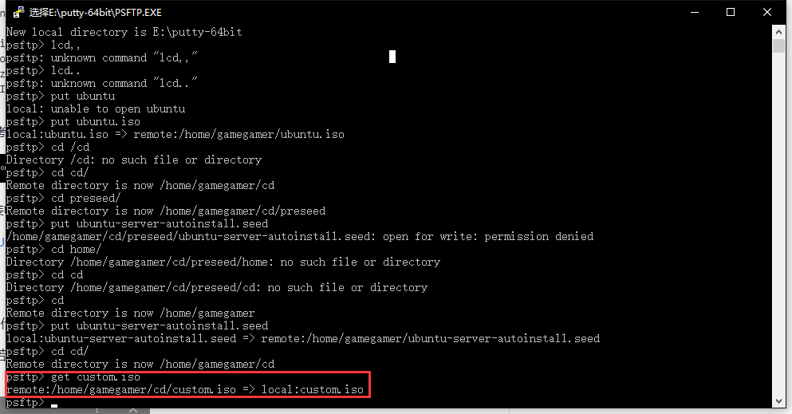

# 第一次作业-无人值守Linux安装镜像制作

## 实验名称

* 无人值守安装ISO制作

## 实现特性

* 定制一个普通用户名和默认密码

* 定制安装OpenSSH Server

* 安装过程禁止自动联网更新软件包

## 实验过程

* 1.使用putty 连接目标主机

* 2.使用psftp将待重打包iso文件传进目标主机（put ubuntu.iso）

* 3.根据实验指导，输入命令如下

		# 在当前用户目录下创建一个用于挂载iso镜像文件的目录
		mkdir cuc
		
		# 挂载iso镜像文件到该目录
		mount -o loop ubuntu.iso loopdir
		
		# 创建一个工作目录用于克隆光盘内容
		mkdir cd
		 
		# 同步光盘内容到目标工作目录
		# 一定要注意loopdir后的这个/，cd后面不能有/
		rsync -av loopdir/ cd
		
		# 卸载iso镜像
		umount loopdir
		
		# 进入目标工作目录
		cd cd/
		
*  4.下图表明已成功将iso文件中内容同步到工作目录
	
	

        # 编辑Ubuntu安装引导界面增加一个新菜单项入口	
		vim isolinux/txt.cfg
		# 添加以下内容到该文件后强制保存退出
			label autoinstall
			  menu label ^Auto Install Ubuntu Server
			  kernel /install/vmlinuz
			  append  file=/cdrom/preseed/ubuntu-server-autoinstall.seed debian-installer/locale=en_US console-setup/layoutcode=us keyboard-configuration/layoutcode=us console-setup/ask_detect=false localechooser/translation/warn-light=true localechooser/translation/warn-severe=true initrd=/install/initrd.gz root=/dev/ram rw quiet
	

    

* 5.将定制好的ubuntu-server-autoinstall.seed文件保存到刚才创建的工作目录~/cd/preseed/ubuntu-server-autoinstall.seed

    * 修改前后的文件对比 

	
	
	* 直接上传失败，传到其它文件夹后拷贝到相应文件夹
	
	

    
	
* 6.修改isolinux/isolinux.cfg，增加内容timeout 10
	
	
* 7.生成iso文件

		# 重新生成md5sum.txt
			cd ~/cd && find . -type f -print0 | xargs -0 md5sum > md5sum.txt
			
			# 封闭改动后的目录到.iso
			IMAGE=custom.iso
			# 路径要写成绝对路径，不然会出错
			BUILD=/home/cuc/cd/
			
			mkisofs -r -V "Custom Ubuntu Install CD" \
			            -cache-inodes \
			            -J -l -b isolinux/isolinux.bin \
			            -c isolinux/boot.cat -no-emul-boot \
			            -boot-load-size 4 -boot-info-table \
			            -o $IMAGE $BUILD

    * 安装mkisofs，运行脚本
    
    
    
    

* 8.生成好了.iso，然后在psftp中用get拷出来

	

## 遇到的问题

1.安装中文版ubuntu系统时出现系统安装失败
 
* 解决方法：在第一个选项选US后安装成功
    
2.安装为中文版系统时出现乱码

* 修改各种配置文件均没有解决，重新安装了英文版系统
 
3.启用host-only网卡后，在系统中没有看到

* 解决方法：修改配置文件
* [参考链接](http://blog.csdn.net/sch0120/article/details/53073999)

4.创建文件时，没有权限

* 解决方法：使用强制保存