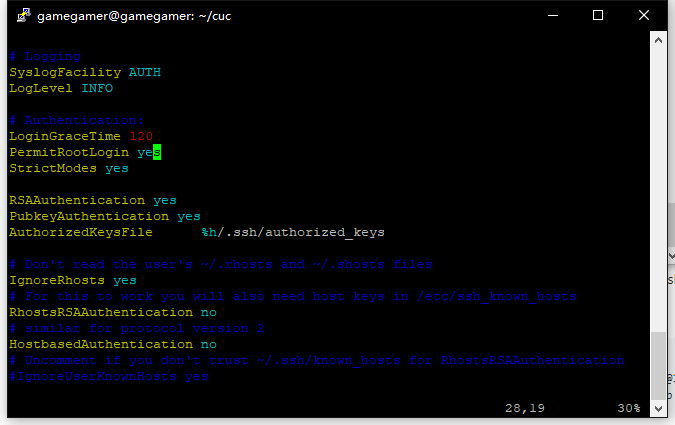
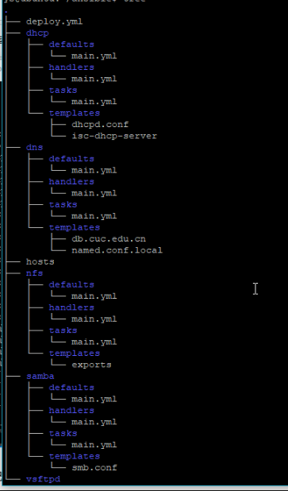
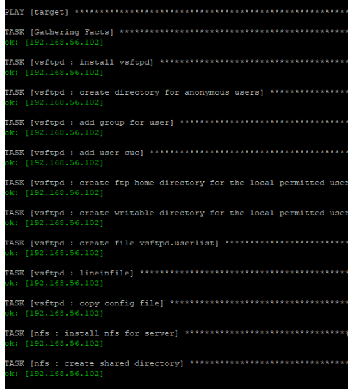

## 第七次作业-使用ansible技术重构FTP、NFS、DHCP、DNS、Samba服务器的自动安装与自动配置

#### 安装ansible

```
sudo apt update && sudo apt install ansible
```

#### root免密登录

修改目标主机配置文件/etc/ssh/sshd_config



在工作机器上运行

```
ssh-keygen -t rsa
scp .ssh/id_rsa.pub ghan@192.168.56.109:/home/ghan
cat /home/ghan/id_rsa.pub >>/root/.ssh/authorized_keys
```

* 参考链接

  * https://www.cnblogs.com/huxinga/p/6418790.html
  
  * https://blog.csdn.net/sinat_35820101/article/details/78393088
  
#### 实验结果

* 在deploy.yml中用roles定义不同任务，每个roles中

  * tasks执行主脚本，实现配置功能
  
  * defaults定义配置变量信息
  
  * handlers负责配置后的重启服务
  
  * templates是改动好的定制配置文件
  


运行结果

