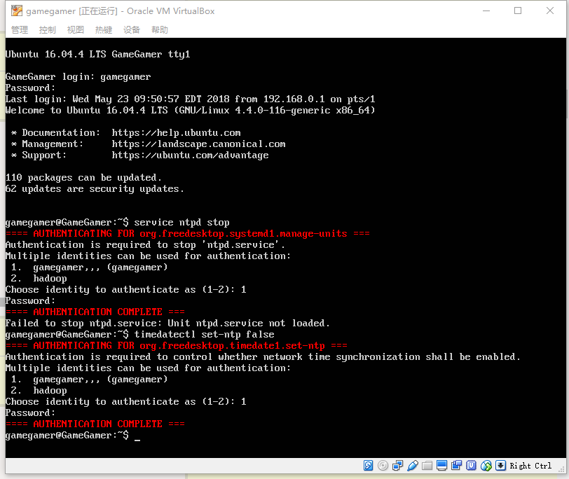
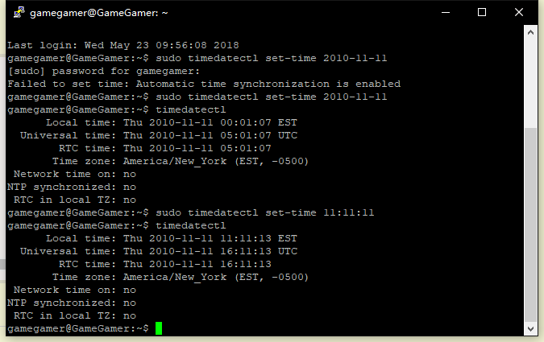
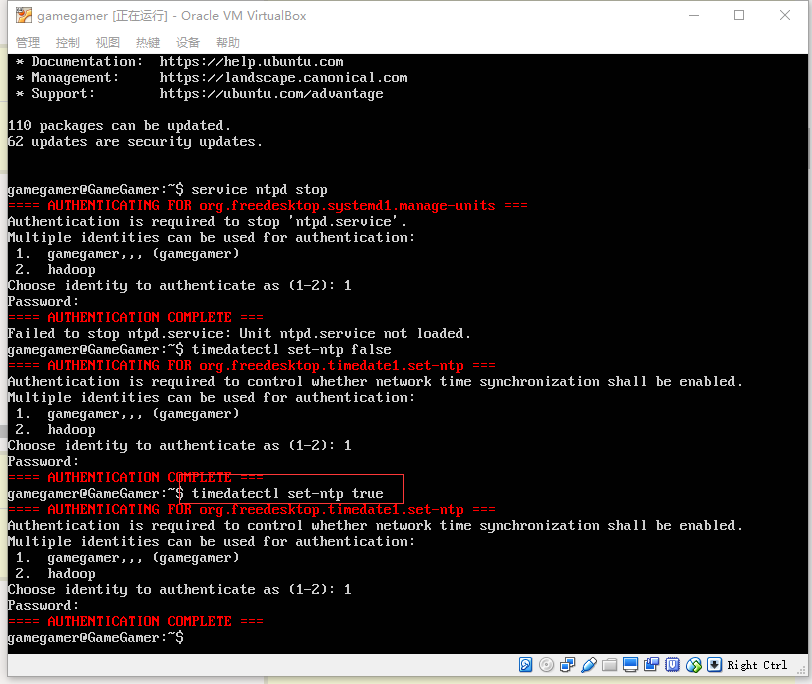
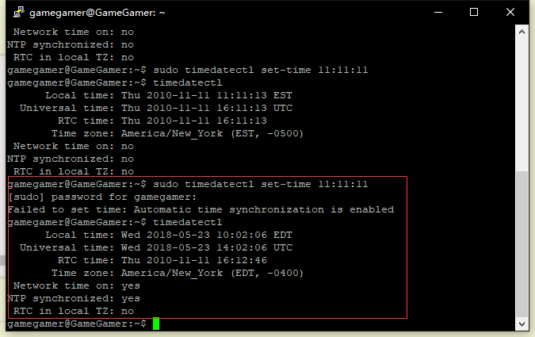
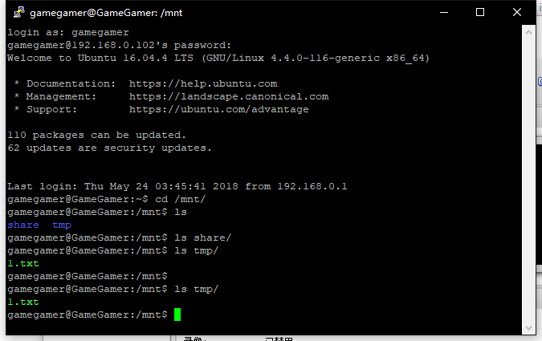
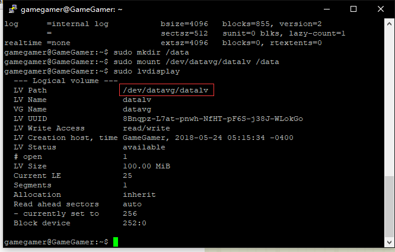
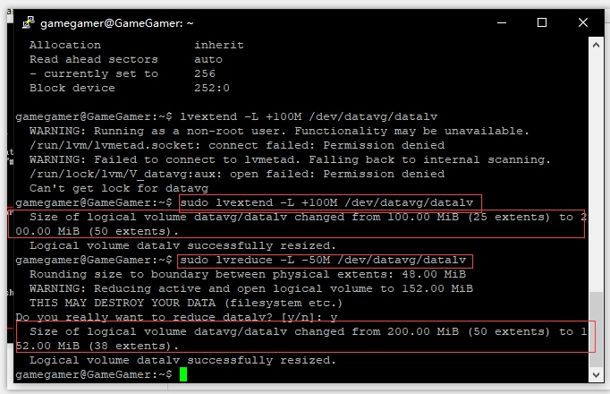
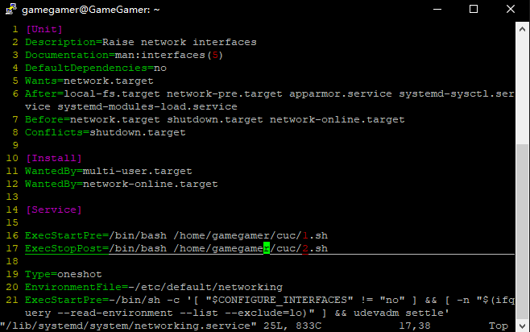

# 开机自启动项管理

* 重启、关机等命令没有录入视频

### 命令篇

#### 1. systemctl

* systemctl是 Systemd 的主命令，用于管理系统。

#### 2. [systemd-analyze](https://asciinema.org/a/msTN0y9Emu8ZwZVBplAExEMO6)

#### 3. [hostnamectl+localectl+timedatectl+loginctl](https://asciinema.org/a/DwPY1CJMUayI9xakZbymfZprn)

* 错误信息：Failed to set time: Automatic time synchronization is enabled

* 用网上的方法关闭ntpd服务后，putty的连接会未响应，直接在虚拟机中用关闭时间同步，时间设置成功

```
timedatectl set-ntp true／false
```





打开时间同步后，时间设置失败





#### 4. [Unit](https://asciinema.org/a/Ttp0QYveASk2Zpeq7bQPwAo89)

#### 5. [Target](https://asciinema.org/a/kJQCRRy639u7l0jHL1mTiyPWk)

#### 6. [journalctl](https://asciinema.org/a/iCHqXrlVVp7o3kd77dLdFffbu)

### 实战篇

#### 1. [视频链接](https://asciinema.org/a/DzTqbExGZYqUF8iLlmpjRC1Kd)

* 大部分都在命令篇中执行过，所以只有简单的演示

### 自查清单

* 如何添加一个用户并使其具备sudo执行程序的权限？

```
adduser username 
#添加用户
sudo usermod -aG sudo username
# 将用户添加到sudo组
```


* 如何将一个用户添加到一个用户组？

```
sudo usermod -aG groupname username
```

* 如何查看当前系统的分区表和文件系统详细信息？

```
fdisk -l
```

* 如何实现开机自动挂载Virtualbox的共享目录分区？

```
# ref: https://michlstechblog.info/blog/systemd-mount-examples-for-cifs-shares/
# 注意这里的 automount 文件命名必须和文件中定义的挂载点路径满足以下严格要求（摘自官网文档）：
# Mount units must be named after the mount point directories they control. Example: the mount point /home/lennart must be configured in a unit file home-lennart.mount.
# 否则的话，在启动时，会报错记录在系统日志中如下：
# Unknown section 'Mount'. Ignoring.
sudo vi /etc/systemd/system/mnt-tmp.mount
sudo systemctl list-unit-files | grep mnt-tmp.mount
sudo systemctl enable mnt-tmp.mount
```
其中 /etc/systemd/system/mnt-tmp.mount 文件内容如下：

```
[Unit]
Description=vbox shared dir mount script
Requires=network-online.target
After=network-online.service

[Mount]
# 这里的 tmpvbox 是在 Virtualbox 共享文件夹设置里指定的 共享文件夹名称
What=tmpvbox

# 这里的 /mnt/tmp 是挂载目的目录，如果没有，需要事先创建好
Where=/mnt/tmp

# 指定挂载文件系统类型
Type=vboxsf

[Install]
WantedBy = multi-user.target
```

然后创建一个 自动挂载类型的 Unit 文件 ： /etc/systemd/system/mnt-tmp.automount 文件内容如下

```
[Unit]
Description=vbox shared dir mount script
Requires=network-online.target
After=network-online.service

[Automount]
Where=/mnt/tmp
TimeoutIdleSec=10

[Install]
WantedBy = multi-user.target
```

保存完上述 Unit 文件之后，执行 sudo systemctl enable mnt-tmp.automount。重启系统，验证共享目录自动挂载。



[参考链接](https://github.com/CUCCS/2015-linux-public-songyawen/pull/2#discussion_r176981741)

* 基于LVM（逻辑分卷管理）的分区如何实现动态扩容和缩减容量？





* 如何通过systemd设置实现在网络连通时运行一个指定脚本，在网络断开时运行另一个脚本？

```
sudo vim /lib/systemd/system/networking.service
```



其中两个脚本分输出一个语句到1.txt中


* 如何通过systemd设置实现一个脚本在任何情况下被杀死之后会立即重新启动？实现杀不死？

  * 修改该脚本的配置文件[service]部分

```
Restart:always
```