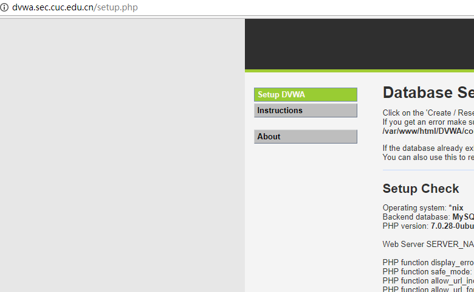

# 第五次作业-web服务器配置

服务|verynginx|nginx|WordPress|DVWA
----|----|----|----|----
监听端口|80|127.0.0.1:8080/8081|8080|8081

### 安装verynginx和nginx

先运行命令
```
 sudo apt install  libpcre3 libpcre3-dev libssl-dev build-essential
```

1. 依照官方文档安装verynginx

2. 开启verynginx失败，显示地址已被使用

3. 关闭Apache2服务，再次开启verynginx，依旧失败（第一次成功了，写报告的时候失败了）


4. 关闭Apache2开机自启动后重启

5. 依旧无效，出来的还是Apache页面，通过访问其它网页发现404显示为nginx服务，想起来之前安装了nginx，于是查看并且关闭了nginx进程，开启verynginx，成功


6. nginx与verynginx无法同时开启，因为两者同时监听了80端口，修改/etc/nginx/sites-available/default文件，将nginx监听的端口改为8080，同时开启成功


### 安装Wordpress

[安装Wordpress参考文档](https://www.digitalocean.com/community/tutorials/how-to-install-wordpress-with-lemp-on-ubuntu-16-04)

安装完成后发现无法打开php页面，通过查询得知nginx通过把php页面转发到php-fpm监听的9000端口，得到php页面的执行效果，查看主机监听的端口，没有127.0.0.1:9000

[解决php参考文档](https://note.youdao.com/)


按照文档对nginx配置文件进行修改后，将listen改为listen=/run/php/php7.0-fpm.sock,php环境配置成功


显示没有mysql扩展，查询后运行命令

```
sudo apt install php-mysql

service nginx restart
```

完成安装，重启服务，成功


出现新的错误，数据库连接出错


查看配置文件后发现是因为之前在解决php的时候重新复制了配置文件，导致其中的配置被覆盖，修改配置文件后，数据库连接成功


设置用户名密码，登录，弹出没有权限访问


按照安装Wordpress参考文档重新进行权限设置，发现是无法访问/wp-admin/文件夹，但其中的页面可以访问，查看nginx配置文件后发现默认访问文件少了index.php，导致返回403错误，修改后成功


设置反向代理

### 安装DVWA

```
git clone https://github.com/ethicalhack3r/DVWA
```

把下载的文件放入/var/www/html/文件夹下，浏览器打开链接


显示错误信息


将DVWA/config/文件夹下的config.inc.php.dist文件去掉后缀.dist，刷新页面，成功




设置反向代理，成功

### 遇到的问题

1. WordPress会在数据库中存入第一次访问的域名，若用第一次用ip访问，则之后的访问会强制跳转
 


解决方法：在主页的设置中修改链接（最好清空缓存后再访问域名，否则有可能因为缓存而连接失败）


2. verynginx在用hosts访问的状况下有时会出现404错误


解决方法：用ip方式访问，或者重启nginx服务，清空缓存，再用域名方式访问


### verynginx配置
* Request Matcher


* Response


* Filter 


* 使用IP地址方式均无法访问上述任意站点，并向访客展示自定义的友好错误提示信息页面-1


* Damn Vulnerable Web Application (DVWA)只允许白名单上的访客来源IP，其他来源的IP访问均向访客展示自定义的友好错误提示信息页面-2
 


* 在不升级Wordpress版本的情况下，通过定制VeryNginx的访问控制策略规则，热修复WordPress < 4.7.1 - Username Enumeration
  
  * [漏洞描述](http://www.cnblogs.com/adislj777/p/6980472.html)
  
  * 解决方法：未登录用户禁止访问站点的/wp-json/wp/v2/users/

* 查看cookies
  


* 未登录效果


* 登录效果


* VeryNginx的Web管理页面仅允许白名单上的访客来源IP，其他来源的IP访问均向访客展示自定义的友好错误提示信息页面-3


* 单ip访问速率限制
 
```
ab -n 1000 -c 1000 http://wp.sec.cuc.edu.cn/
ab -n 1000 -c 1000 http://dvwa.sec.cuc.edu.cn/
```


* 遇到的问题

wp.sec.cuc.edu.cn实验成功，dvwa.sec.cuc.edu.cn用ab命令失败，手动修改为单ip每秒限制访问1次后，手动刷新限制成功。

* 进制curl访问

