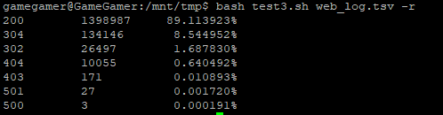

# 第四次作业-shell脚本编程

[hw1.sh](test1.sh)

- 任务一：用bash编写一个图片批处理脚本，实现以下功能：

  - 支持命令行参数方式使用不同功能
    
    
    
    - 支持对指定目录下所有支持格式的图片文件进行批处理
    
    - 支持以下常见图片批处理功能的单独使用或组合使用
    
    
    
    - 支持对jpeg格式图片进行图片质量压缩
        
    
        
    - 支持对jpeg/png/svg格式图片在保持原始宽高比的前提下压缩分辨率

    
    
    - 支持对图片批量添加自定义文本水印
    
    
    
    
    
    - 支持批量重命名（统一添加文件名前缀或后缀，不影响原始文件扩展名）
    
    
    
    - 支持将png/svg图片统一转换为jpg格式图片
    
    

[hw2.sh](test2.sh)

- 任务二：用bash编写一个文本批处理脚本，对以下附件分别进行批量处理完成相应的数据统计任务：

  - 2014世界杯运动员数据

    - 统计不同年龄区间范围（20岁以下、[20-30]、30岁以上）的球员数量、百分比
    
    - 统计不同场上位置的球员数量、百分比
    
    - 名字最长的球员是谁？名字最短的球员是谁？
    
    - 年龄最大的球员是谁？年龄最小的球员是谁？
    
    
    
    - 结果文件
    
    [hw2.tsv](hw2.tsv)

[hw3.sh](test3.sh)

- 任务三：用bash编写一个文本批处理脚本，对以下附件分别进行批量处理完成相应的数据统计任务：

  - [Web服务器访问日志](web_log.tsv)
    
    - 统计访问来源主机TOP 100和分别对应出现的总次数
    
    

    - 统计访问来源主机TOP 100 IP和分别对应出现的总次数
    
    
    
    - 统计最频繁被访问的URL TOP 100
    
    
    
    - 统计不同响应状态码的出现次数和对应百分比
    
    
    
    - 分别统计不同4XX状态码对应的TOP 10 URL和对应出现的总次数
    
    
    
    - 给定URL输出TOP 100访问来源主机
    
    